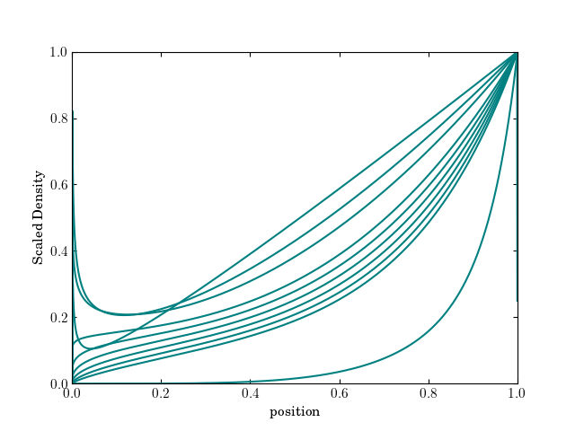

# Self sImilar SoluTions foR yoU and Me (SISTRUM)
A [percussion instrument](https://en.wikipedia.org/wiki/Sistrum) and also a repository of Python 3.x [self-similar solutions](https://en.wikipedia.org/wiki/Self-similar_solution) that I've needed, and so written.
Contributions welcome.

# [Sedov-Taylor blast wave](src/sedov.py)
Self-similar solution for the Sedov-Taylor non-relativistic blast wave.
Based on work by [James R. Kamm](https://cococubed.com/papers/kamm_2000.pdf) and [Kamm & Timmes](https://cococubed.com/papers/la-ur-07-2849.pdf).
Supports density profiles of the from $\rho(r) = \rho_{0} r^{-w}$.
Supports planar (`j = 1`), cylindrical (`j = 2`), and spherical (`j = 3`) geometries.
There are constraints on the density power law index. 
See the paper.

## Usage
```python
from sedov import Sedov
sedov_solution = Sedov(j, w, E, rho0, gamma, t_end, r_model)
r = sedov.r
rho_sol = sedov.rho_sol
# plot away
```

## TODO:
- Some solutions, such as velocity, still need implementation.
- Unit test against [`sedov3`](https://cococubed.com/research_pages/sedov.shtml).



# [Blandford McKee Blast Wave](src/bmk.py)
See [the paper](https://ui.adsabs.harvard.edu/abs/1976PhFl...19.1130B/abstract).
Computes post-shock similarity variables and pressure, etc.
Assumes density profiles of the from $\rho(r) \propto r^{-k}$.

## Usage
```python
from bmk import BMK
bmk_solution = BMK(k, W, t, P0, t_shock, rad)
rad = bmk_solution.r
pressure = bmk_solution.p # see also bmk_solution.f for similarity variable
```

# Code Style
Code linting and formatting is done with [ruff](https://docs.astral.sh/ruff/).
Rules are listed in [ruff.toml](ruff.toml).
